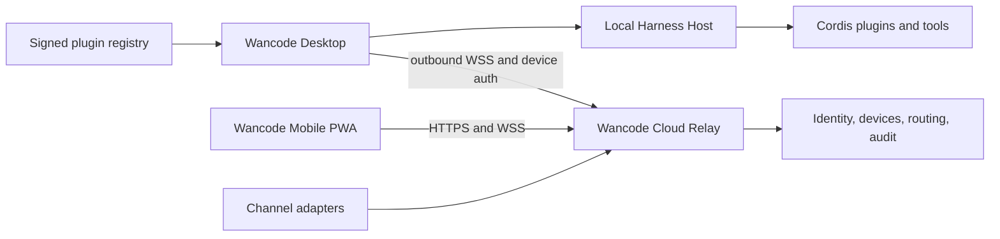

# Wan Code delivery plan

Status: active

## Progress

- M0 complete: the private GitHub repository exists, the current Desktop
  baseline is on `master`, official Harness is pinned as a read-only submodule,
  and the Yarn/pnpm ownership gate passes.
- M1 desktop core is accepted on `master`. Signed production NSIS release remains
  deferred until a code-signing certificate and trusted previous installer exist.
- M2 in progress: `@wancode/relay-protocol` encodes the fail-closed remote
  protocol, Ed25519 device keys, X25519 device-to-device sealed payloads,
  desktop-only outbound handshake, the outbound WebSocket dialer, short-lived
  device-bound access tokens, a replaceable OIDC identity seam, immediate
  device registration/revocation, same-account routing, per-device rate limits,
  a plaintext-free audit log, sealed-box routing and offline mailbox delivery,
  same-socket reconnect drain and ack, live sealed-box fan-out to an online
  destination socket,   a JWKS-backed OIDC verifier plus an opt-in HTTPS JWKS
  fetch that never carries credentials, a loopback HTTP control plane for
  register/token/revoke plus the same outbound
  WebSocket acceptor, an outbound HTTPS client for the same control routes,
  and an opt-in desktop Host plugin that never listens, derives the HTTPS
  origin from its WebSocket URL, and does not dial until connect is invoked.
  The local device identity is generated once, stored in Windows Credential
  Manager, and used to enroll and sign handshakes without exposing private keys.
  Same-account device list is available over POST `/v1/devices/list` without
  private keys or query-string tokens. A registered desktop can mint a one-time
  pairing grant over POST `/v1/pairing/grants` with exactly one of an OIDC
  assertion or that desktop's access token; the typed code is hashed at rest,
  expires in five minutes, and is not a JWT. POST `/v1/pairing/redeem` registers
  the PWA and returns a device-bound token plus the minting desktop.
  Loopback cloud HTTP echoes a loopback browser `Origin` for CORS so the pairing
  page can redeem; public HTTPS origins fail closed.
- M3 started: `@wancode/relay-pwa` projects session events without prompt text
  or model credentials, lists same-account desktops, and can enroll as a PWA
  device then send sealed follow-ups, approvals, and cancels over outbound
  HTTPS/WSS. Selecting the local PWA as the desktop fails closed.
  `listDesktops` omits local ids and untrusted encryption keys. Handshake nonces use WebCrypto.
  PWA handshake signatures use WebCrypto. PWA follow-ups are sealed and opened with WebCrypto. Reconnect drains mailbox mail, folds streaming progress into
  session snapshots, and projects `notify.*` events. Progress details are
  capped. Empty session ids and empty approval request ids fail closed. A denied
  approval keeps `pendingRequestId` until the request is cancelled or replaced.
  Missing desktop apply sinks fail closed instead of acknowledging the mail.
  Listed control-plane devices refuse non-Ed25519 / non-X25519 keys. The account
  device list omits those rows so a poisoned store cannot fail the whole list.
  Device registration requires an X25519 encryption public key. Listed devices
  without that key are omitted, and the outbound list parser refuses them.
  `createWebCryptoDeviceIdentity` mints Ed25519 and X25519 keys without
  `node:crypto`; missing WebCrypto fails closed. `loadPwaRelayIdentity`
  mints that identity once into caller-supplied storage; public peeks omit
  private keys, and the origin `sessionStorage` key cannot hold identity.
  Identity storage is async so IndexedDB can hold the blob; `sessionStorage`
  itself is refused.   `openPwaRelayIdentityIndexedDb` opens that database.
  Pairing can enroll from that IndexedDB factory when no identity blob is
  supplied. `createPwaRelayController` can enroll from that store without taking private
  keys on the pairing input. `enrollPwaPairingShell` remembers a valid origin in
  `sessionStorage` and mints or reloads that IndexedDB identity from the pairing
  page; private keys never share the origin key. The installable Web App
  Manifest and fail-closed cache policy exist; the install `id` stays relative.
  `createPwaServiceWorkerSource`
  emits the matching worker and deletes stale caches on activate.   `createPwaShellFiles` returns the static index,
  manifest, worker, and `pair.js`.   The index has no inline script. Apple and Android home-screen metas are present.
  A valid relay origin may be remembered in `sessionStorage` only; hash
  fragments fail closed so `#access_token=` cannot be pasted in.
  Submit enrolls a WebCrypto identity into IndexedDB and never stores that
  blob in the origin `sessionStorage` key. `pair.js` shows a remembered public
  desktop id from `sessionStorage` and clears poisoned desktop slots.
  Forget pairing clears the origin and desktop slots without touching IndexedDB
  and without calling revoke. The pairing form accepts an optional pairing
  code that is not a JWT and is never stored. A valid code is redeemed over
  POST `/v1/pairing/redeem`; only the public desktop id and encryption key are
  remembered. The returned access token is used to dial outbound `/v1` and is
  not stored. After handshake the pairing page can send a sealed follow-up to
  a live desktop session id. `createPwaRelayController` may omit
  the WebSocket URL and derive `/v1` from the pairing origin.
  `openPwaRelayFromOrigin` remembers that origin, loads IndexedDB identity,
  then registers and dials. `openPwaRelayFromPairingCode` redeems a one-time
  desktop pairing grant instead of an OIDC assertion. `rememberPwaSelectedDesktop` stores only public
  desktop fields. `selectDesktop` writes that slot when sessionStorage is supplied.
  `openPwaRelayFromOrigin` selects the only listed desktop when none was
  supplied or remembered. `selectSolePwaDesktop` picks the only listed
  desktop; zero or multiple candidates fail closed. `forgetPwaSelectedDesktop` clears that slot.
  `unpairPwaRelay` revokes the PWA immediately and forgets the desktop and origin.
  Pairing-code sessions list and revoke with the redeemed access token; that
  token may only revoke itself.
  Mismatched HTTP and WebSocket origins fail closed.
  `PWA_SHELL_CSP` forbids `unsafe-inline`, frames, and plugins.   The PWA can also send sealed presence and revoke itself
  immediately. Presence state must be online or offline. Follow-up text is required and capped. Checked-in `public/`
  shell files, including PNG icons, match the generators. Desktop identity can
  open sealed PWA follow-ups without exposing private keys,
  and can `sealTo` a PWA encryption public key. `sealDesktopRelaySessionEvent`
  allows only compact progress types and never seals prompt text.
  Empty recipient encryption keys fail closed.
  `sendDesktopRelaySessionEvent` pushes that box over the outbound socket.
  After connect, `sendProgress` uses the same path and refuses to send before
  the socket exists. `sendPresence` seals online/offline frames the same way. `drainDesktopRelayMail` reclaims
  queued boxes and acks only queued ids. `processDesktopRelayMail` applies
  follow-ups locally first and acks queued ids only after that sink succeeds.
  `applyDesktopRelayPayloads` hands follow-ups to a local session sink so
  model credentials stay on the desktop. Approval and cancel frames require
  those sinks and are not dropped. `createDesktopRelayFollowUpSink`
  refuses missing session ids. Approval and cancel sinks refuse missing
  request ids. `createDesktopRelayApplySinks` binds those lookups together.
  `createDesktopRelayHostApplySinks` queues follow-ups through Host
  `prompt([{ type: 'text', text }], 'queue')` and maps approvals to Host
  `respond('allowed-once' | 'rejected')` without injecting Host services.
  `prepareDesktopRelay` may take those sinks so `processMail` can apply
  follow-ups after connect without repeating them.
  `lookupDesktopRelayHostApplySinks` probes `ctx.get('sessions')` without
  adding a required inject. Host `prompt` / `respond` and Client `submit` /
  `decide` shapes are both accepted. Session id `queue` creates a new Host
  session when `sessions.create` exists; missing `create` still fails closed.   `bindDesktopRelay` returns that handle so connect
  and processMail can run after apply. `mintPairingGrant` issues a one-time
  pairing code over outbound HTTP without opening a socket. After `connect`,
  the session token may replace the OIDC assertion. When `desktopRuntime` is
  present, apply registers an effect-scoped **Copy Pairing Code** tray command
  that copies the minted display form and notifies without including the code.
  Missing runtime stays idle. `openDesktopRelaySession` enrolls the
  stored identity, mints a token, and dials. A missing nonce is minted with
  WebCrypto. `openDesktopRelayMailbox` then applies queued PWA mail.
  Mail processing repeats that lookup so a late
  Host session still applies follow-ups.
  The installable shell includes PNG icons and may be served from
  `@wancode/relay-pwa/host` on 127.0.0.1 only. Non-loopback Host headers fail
  closed. It does not listen on a public interface. Non-loopback Origin and
  Referer headers also fail closed. Loopback responses send
  `Referrer-Policy: no-referrer` and disable camera, microphone, and
  geolocation. Encoded or `..` paths fail closed. `createPwaDeployFiles`
  includes PNG icons so a static HTTPS origin can host the shell.
  `assertPwaShellOrigin`
  requires HTTPS or loopback HTTP so a public install cannot use cleartext.
- The Windows package gate currently passes with 252 focused tests plus the
  runtime-closure verifier. Cross-platform macOS-only tests are not treated as
  Windows release gates.

## Goal

Build Wan Code as a Windows-first coding-agent product on the published
DeepSeek Harness runtime. Version 1 includes the desktop core, an encrypted
cloud relay, an installable mobile PWA, a reviewed plugin marketplace, and
official IM channel adapters.

## Provenance and ownership

- `deepseek-harness/` is the pinned, read-only official source submodule.
- `dsh-plugin-desktop/` is the Wancode-owned Electron and Cordis desktop module.
- `dsh-community-fabric/` remains the interoperability-contract workspace.
- `dsh-community-market/` evolves from a documentation scaffold into the
  reviewed marketplace module only after its schemas and trust gates pass.
- New product modules belong under `apps/` or `packages/wancode/`; they must
  consume published Harness interfaces and must not patch the submodule.

The original ThomasWan Harness fork matched official upstream when assessed.
The ThomasWan Desktop fork was 117 commits behind its parent, so this repository
starts from the current `anywhere-labs/deepseek-harness-desktop` topology and
keeps official Harness as an independently pinned source.

## Target architecture

The local Host remains loopback-only. Desktop initiates the cloud connection;
the cloud never opens an inbound port on the user's machine. Sensitive relay
payloads use device keys and end-to-end encryption.

## Milestones

### M0: reproducible baseline and governance

- Preserve the Yarn product workspace and pnpm upstream submodule boundary.
- Pin the exact Harness source and runtime package family in `upstream.json`.
- Record product vocabulary, upstream policy, architecture decisions, and the
  Wancode-owned change surface.
- Require clean Windows installation, layout, build, typecheck, test, and
  unpacked-package checks.

Exit: a clean Windows runner reproduces the product build from the lockfile.

### M1: Wancode Windows desktop core

- Rebrand the application identity, installer, executable, data directory,
  update channel, user-facing copy, and assets while retaining attribution.
- Keep the Electron renderer sandboxed and navigation restricted to the local
  Host origin.
- Add project selection, crash recovery, diagnostics, log export, secure
  credential references, and a least-privilege default profile.
- Produce a signed NSIS installer with stable and beta channels, safe update
  download, migration checks, and rollback.

Exit: install, first run, model setup, project task, session recovery, update,
rollback, and uninstall all pass on Windows x64.

### M2: account and encrypted cloud relay

- Add replaceable OIDC authentication, device registration, short-lived access
  tokens, public device keys, routing, rate limits, revocation, and audit.
- Version the remote protocol: handshake, capabilities, session events, prompt,
  approval, cancellation, presence, acknowledgement, retry, and idempotency.
- Store no plaintext prompt, credential, or tool output in relay logs.

Exit: replay, expired token, revoked device, and cross-account access fail
closed; reconnect and offline delivery remain idempotent.

### M3: mobile PWA

- Reuse session-event projections and shared protocol types, not desktop UI.
- Support device selection, sessions, streaming progress, follow-up messages,
  tool approval, cancellation, notifications, and low-bandwidth reconnect.
- Keep model credentials on the paired desktop.

Exit: an installed iOS or Android PWA controls an authorized Windows desktop
over the public internet and can be revoked immediately.

### M4: reviewed plugin marketplace

- Implement signed manifests, compatibility ranges, capability declarations,
  dependency resolution, version locks, health checks, atomic activation, and
  rollback.
- Add publisher identity, review state, digest/signature verification, package
  withdrawal, and an emergency kill switch.
- Require explicit user approval for file, command, network, credential, MCP,
  and remote-control capabilities.

Exit: tampering, signature mismatch, permission escalation, incompatible
versions, and withdrawn packages are rejected or safely disabled.

### M5: channels

- Define one adapter interface for authentication, webhook verification, user
  binding, normalized messages, attachments, threads, retries, rate limits,
  and revocation.
- Implement Feishu, Discord, and WhatsApp through official APIs.
- Treat WeChat as conditional on the available official account API and review;
  personal-account automation is out of scope.
- Keep group chats unable to execute high-risk tools by default.

Exit: duplicate webhooks do not duplicate tasks, tenants cannot cross-route,
and acknowledged work survives provider outages.

### M6: quality, security, and compatibility

- Retain Harness unit, coverage, snapshot, browser, and real-provider gates.
- Add Electron smoke tests, Windows installer lifecycle tests, relay contracts,
  PWA browser tests, webhook contracts, and plugin supply-chain tests.
- Threat-model the local carrier, Electron renderer, shell/fs/MCP, encryption
  keys, marketplace, webhooks, SSRF, replay, tenancy, and telemetry.
- Test migrations from every supported session, settings, credential reference,
  plugin lock, and remote-protocol version.

### M7: release and upstream maintenance

- Separate core, desktop, cloud/PWA, channels, and release CI lanes.
- Release with an exact Harness commit, runtime family, protocol version,
  migration version, Wancode commit, SBOM, and checksums.
- Open automated upstream-update pull requests; never auto-release from an
  unverified upstream branch.
- Start macOS release work only after Windows stable meets reliability, update,
  and data-recovery targets. Linux follows later.

## Delivery order

1. M0 and M1 produce the independently useful Windows desktop.
2. M2 and M3 close the encrypted mobile-control loop.
3. M4 opens the reviewed marketplace.
4. M5 enables channels independently so platform approval cannot block desktop.
5. M6 and M7 are continuous gates for every milestone.

## Current implementation slice

M0 is complete. M1 desktop core is accepted on `master`; signed production NSIS
release remains deferred pending a code-signing certificate.

M2 starts with `@wancode/relay-protocol`. The control plane accepts a versioned
ciphertext envelope only after a live token matches a registered, non-revoked
device. Identical retries of the same message id stay idempotent; a mutated
payload is replay and fails closed. Unknown protocol versions and plaintext
prompt, credential, or tool-output fields are rejected before routing.

A desktop device holds an Ed25519 signing keypair and an X25519 encryption
keypair, and opens a session with a signed outbound handshake. The relay
verifies that signature against the registered public key, grants only the
closed capability list, and refuses inbound claims, untrusted keys, unknown
capabilities, and reused nonces. Handshake and ack ciphertext never include
the private key or application plaintext. Application prompt, approval,
cancel, session-event, and presence frames are sealed to the recipient
encryption public key so the relay never opens the box. Empty envelope ids
fail closed before encryption. Desktop
initiates the cloud connection over outbound WSS. The same package sends the
signed handshake as the first JSON frame after presenting a short-lived token,
waits for `handshake-ack`, and refuses non-loopback cleartext WebSocket. After
that handshake, the same outbound socket may send sealed application frames.
The 127.0.0.1 loopback acceptor delivers or queues those boxes without opening
them. An online destination receives a sealed push on its own outbound socket.
The destination socket then reclaims any leftover mailbox and acknowledges each
frame; device id comes from the presented token. Closing the socket marks the
handshake device offline. The package does not listen on a public interface and
does not declare a Harness plugin
entry. A 127.0.0.1 loopback acceptor exists only as a test double under the
`./loopback` export. `./cloud` adds loopback HTTP registration, token minting,
and revocation on the same acceptor and still refuses non-loopback binds. A replaceable OIDC identity provider verifies issuer,
audience, subject, and expiry before a device may register. Production
verifies compact ES256 or RS256 JWTs against a caller-supplied JWKS.
`fetchOidcJwks` may load that JWKS over HTTPS; redirects are re-checked and
the request never carries credentials. Revoking that
device fails closed immediately and the device id cannot be reused. Sealed
application envelopes route only to another device on the same account. Opaque
prompt ciphertext and handshake frames are not routed. Cross-account
destinations, unknown devices, and per-device rate-limit excess fail closed.
Identical retries stay idempotent and do not consume the limiter. The audit log
records route outcomes without prompt, credential, tool-output, or ciphertext
fields. Offline destinations queue the same sealed box until the device
reconnects and acknowledges each frame; identical reconnect drains stay
idempotent. Desktop
loads an opt-in `desktop-relay` Host row that stays idle by default, never binds
a port, and only dials a fail-closed outbound URL when `connect` is called.
The same handle can register, mint a token, or revoke over outbound HTTPS
derived from that WebSocket URL before any socket is opened. The local device
identity is created once, stored under Windows Credential Manager, and used to
enroll the public keys and mint a signed handshake without putting private keys
on the returned object or in settings files.

M3 starts with `@wancode/relay-pwa`. A paired PWA device reuses the relay
application payload types and projects them into a UI-neutral session view.
Prompt text and model credential fields stay off that view. The PWA enrolls
over outbound HTTPS, dials outbound WSS, and seals follow-ups to the desktop
encryption public key. Model credentials remain on the desktop. The package
does not listen, does not declare a Harness plugin entry, and is not yet an
installable iOS or Android application.

M1 now includes Wancode application and installer identity,
an isolated Harness home, telemetry-private defaults, GitHub release discovery,
and immutable Wancode release asset URLs.

On Windows, the desktop profile replaces the plaintext Harness credential file
with a Wancode-owned `CredentialProvider` backed by Windows Credential Manager.
The provider preserves inherited environment and project/user `.env` precedence,
and imports then removes a legacy `.credentials.yaml` only after every secure
write succeeds.

Downloaded Windows updates must pass PE validation and Windows Authenticode
trust validation before Electron can open them. A separate signed-release path
requires an explicit certificate source and expected publisher, builds both the
application and NSIS installer with Electron Builder, and verifies that both
artifacts are trusted and use the same publisher certificate.

The desktop settings now expose stable and beta GitHub release streams; changing
the stream restarts into a generation whose update checker, prompt history, and
asset download all accept the selected SemVer class. The signed release path now
requires an older trusted installer and an explicitly disposable Windows runner,
then verifies install, upgrade, rollback, current-version restore, and uninstall
while pinning every executable transition to the expected Authenticode publisher.
Executing that gate still requires the project's signing certificate and a
signed previous release. Update handoff now persists a fail-closed v4 transition
record. The target version must report terminal application health within 30
seconds. A failed Host or renderer startup, or a missed deadline, triggers one
automatic Windows recovery attempt that re-downloads, revalidates, and launches
the previous installer without another confirmation dialog. The one-shot marker
prevents rollback loops; a healthy start retains the confirmation-gated tray
rollback, and starting the previous version clears the transition.

Launcher composition now pins new desktop sessions to the `read-only` permission
preset unless `DSH_PERMISSION_MODE` names `workspace-write` or
`danger-full-access`. The in-app Permissions selector still changes later
sessions through the upstream settings and session pins.

First launch of an empty isolated Wan Code home can copy an existing `~/.dsh`
tree after a native confirmation. The original install is left in place, plugin
`node_modules` directories are omitted, and a symlink that escapes the source
home fails closed. An explicit `DSH_HOME` override remains a shared-home choice
and is never rewritten by this import.

Packaged launches mirror stdout and stderr into `logs/wancode.log` under Electron
user data. The tray **Open Diagnostics Folder** command reveals that directory.
If the sandboxed renderer exits abnormally, Wan Code offers reload, diagnostics,
or restart without first tearing down the Host. Clean exits and window unmount
do not open that recovery dialog.
