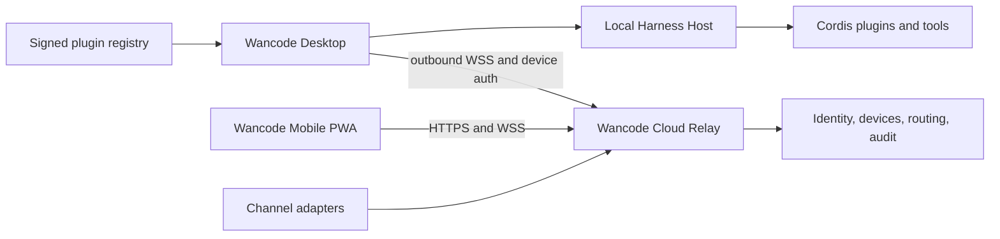

# Wan Code delivery plan

Status: active

## Progress

- M0 complete: the private GitHub repository exists, the current Desktop
  baseline is on `master`, official Harness is pinned as a read-only submodule,
  and the Yarn/pnpm ownership gate passes.
- M1 in progress: native product identity, isolated Harness home, opt-in first-run
  import from `~/.dsh`, telemetry-private defaults, a read-only permission default
  for new sessions, stable/beta updates, confirmation-gated rollback, one-shot
  automatic Windows recovery after a failed or overdue health report, renderer
  crash recovery, and a local diagnostics log.
- The Windows package gate currently passes with 233 focused tests plus the
  runtime-closure verifier. Cross-platform macOS-only tests are not treated as
  Windows release gates.

## Goal

Build Wan Code as a Windows-first coding-agent product on the published
DeepSeek Harness runtime. Version 1 includes the desktop core, an encrypted
cloud relay, an installable mobile PWA, a reviewed plugin marketplace, and
official IM channel adapters.

## Provenance and ownership

- `deepseek-harness/` is the pinned, read-only official source submodule.
- `dsh-plugin-desktop/` is the Wancode-owned Electron and Cordis desktop module.
- `dsh-community-fabric/` remains the interoperability-contract workspace.
- `dsh-community-market/` evolves from a documentation scaffold into the
  reviewed marketplace module only after its schemas and trust gates pass.
- New product modules belong under `apps/` or `packages/wancode/`; they must
  consume published Harness interfaces and must not patch the submodule.

The original ThomasWan Harness fork matched official upstream when assessed.
The ThomasWan Desktop fork was 117 commits behind its parent, so this repository
starts from the current `anywhere-labs/deepseek-harness-desktop` topology and
keeps official Harness as an independently pinned source.

## Target architecture

The local Host remains loopback-only. Desktop initiates the cloud connection;
the cloud never opens an inbound port on the user's machine. Sensitive relay
payloads use device keys and end-to-end encryption.

## Milestones

### M0: reproducible baseline and governance

- Preserve the Yarn product workspace and pnpm upstream submodule boundary.
- Pin the exact Harness source and runtime package family in `upstream.json`.
- Record product vocabulary, upstream policy, architecture decisions, and the
  Wancode-owned change surface.
- Require clean Windows installation, layout, build, typecheck, test, and
  unpacked-package checks.

Exit: a clean Windows runner reproduces the product build from the lockfile.

### M1: Wancode Windows desktop core

- Rebrand the application identity, installer, executable, data directory,
  update channel, user-facing copy, and assets while retaining attribution.
- Keep the Electron renderer sandboxed and navigation restricted to the local
  Host origin.
- Add project selection, crash recovery, diagnostics, log export, secure
  credential references, and a least-privilege default profile.
- Produce a signed NSIS installer with stable and beta channels, safe update
  download, migration checks, and rollback.

Exit: install, first run, model setup, project task, session recovery, update,
rollback, and uninstall all pass on Windows x64.

### M2: account and encrypted cloud relay

- Add replaceable OIDC authentication, device registration, short-lived access
  tokens, public device keys, routing, rate limits, revocation, and audit.
- Version the remote protocol: handshake, capabilities, session events, prompt,
  approval, cancellation, presence, acknowledgement, retry, and idempotency.
- Store no plaintext prompt, credential, or tool output in relay logs.

Exit: replay, expired token, revoked device, and cross-account access fail
closed; reconnect and offline delivery remain idempotent.

### M3: mobile PWA

- Reuse session-event projections and shared protocol types, not desktop UI.
- Support device selection, sessions, streaming progress, follow-up messages,
  tool approval, cancellation, notifications, and low-bandwidth reconnect.
- Keep model credentials on the paired desktop.

Exit: an installed iOS or Android PWA controls an authorized Windows desktop
over the public internet and can be revoked immediately.

### M4: reviewed plugin marketplace

- Implement signed manifests, compatibility ranges, capability declarations,
  dependency resolution, version locks, health checks, atomic activation, and
  rollback.
- Add publisher identity, review state, digest/signature verification, package
  withdrawal, and an emergency kill switch.
- Require explicit user approval for file, command, network, credential, MCP,
  and remote-control capabilities.

Exit: tampering, signature mismatch, permission escalation, incompatible
versions, and withdrawn packages are rejected or safely disabled.

### M5: channels

- Define one adapter interface for authentication, webhook verification, user
  binding, normalized messages, attachments, threads, retries, rate limits,
  and revocation.
- Implement Feishu, Discord, and WhatsApp through official APIs.
- Treat WeChat as conditional on the available official account API and review;
  personal-account automation is out of scope.
- Keep group chats unable to execute high-risk tools by default.

Exit: duplicate webhooks do not duplicate tasks, tenants cannot cross-route,
and acknowledged work survives provider outages.

### M6: quality, security, and compatibility

- Retain Harness unit, coverage, snapshot, browser, and real-provider gates.
- Add Electron smoke tests, Windows installer lifecycle tests, relay contracts,
  PWA browser tests, webhook contracts, and plugin supply-chain tests.
- Threat-model the local carrier, Electron renderer, shell/fs/MCP, encryption
  keys, marketplace, webhooks, SSRF, replay, tenancy, and telemetry.
- Test migrations from every supported session, settings, credential reference,
  plugin lock, and remote-protocol version.

### M7: release and upstream maintenance

- Separate core, desktop, cloud/PWA, channels, and release CI lanes.
- Release with an exact Harness commit, runtime family, protocol version,
  migration version, Wancode commit, SBOM, and checksums.
- Open automated upstream-update pull requests; never auto-release from an
  unverified upstream branch.
- Start macOS release work only after Windows stable meets reliability, update,
  and data-recovery targets. Linux follows later.

## Delivery order

1. M0 and M1 produce the independently useful Windows desktop.
2. M2 and M3 close the encrypted mobile-control loop.
3. M4 opens the reviewed marketplace.
4. M5 enables channels independently so platform approval cannot block desktop.
5. M6 and M7 are continuous gates for every milestone.

## Current implementation slice

M0 is complete. M1 now includes Wancode application and installer identity,
an isolated Harness home, telemetry-private defaults, GitHub release discovery,
and immutable Wancode release asset URLs.

On Windows, the desktop profile replaces the plaintext Harness credential file
with a Wancode-owned `CredentialProvider` backed by Windows Credential Manager.
The provider preserves inherited environment and project/user `.env` precedence,
and imports then removes a legacy `.credentials.yaml` only after every secure
write succeeds.

Downloaded Windows updates must pass PE validation and Windows Authenticode
trust validation before Electron can open them. A separate signed-release path
requires an explicit certificate source and expected publisher, builds both the
application and NSIS installer with Electron Builder, and verifies that both
artifacts are trusted and use the same publisher certificate.

The desktop settings now expose stable and beta GitHub release streams; changing
the stream restarts into a generation whose update checker, prompt history, and
asset download all accept the selected SemVer class. The signed release path now
requires an older trusted installer and an explicitly disposable Windows runner,
then verifies install, upgrade, rollback, current-version restore, and uninstall
while pinning every executable transition to the expected Authenticode publisher.
Executing that gate still requires the project's signing certificate and a
signed previous release. Update handoff now persists a fail-closed v4 transition
record. The target version must report terminal application health within 30
seconds. A failed Host or renderer startup, or a missed deadline, triggers one
automatic Windows recovery attempt that re-downloads, revalidates, and launches
the previous installer without another confirmation dialog. The one-shot marker
prevents rollback loops; a healthy start retains the confirmation-gated tray
rollback, and starting the previous version clears the transition.

Launcher composition now pins new desktop sessions to the `read-only` permission
preset unless `DSH_PERMISSION_MODE` names `workspace-write` or
`danger-full-access`. The in-app Permissions selector still changes later
sessions through the upstream settings and session pins.

First launch of an empty isolated Wan Code home can copy an existing `~/.dsh`
tree after a native confirmation. The original install is left in place, plugin
`node_modules` directories are omitted, and a symlink that escapes the source
home fails closed. An explicit `DSH_HOME` override remains a shared-home choice
and is never rewritten by this import.

Packaged launches mirror stdout and stderr into `logs/wancode.log` under Electron
user data. The tray **Open Diagnostics Folder** command reveals that directory.
If the sandboxed renderer exits abnormally, Wan Code offers reload, diagnostics,
or restart without first tearing down the Host. Clean exits and window unmount
do not open that recovery dialog.
